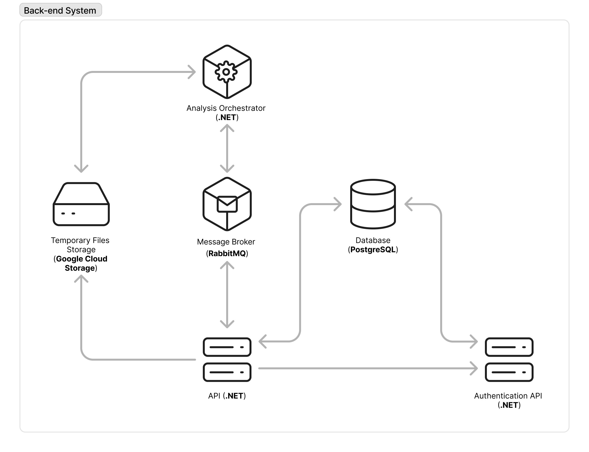

# Openlysis

Openlysis is a back-end system built with ASP.NET for analyzing files, URLs, SMS, and emails using services like VirusTotal, HybridAnalysis, Filescan, and Urlquery. It helps fight phishing and smishing, focusing on non-expert users. The system works alongside the [Openlysis Android app](https://github.com/PabloStarOk/openlysis-android) as its front-end.

## Table of Contents

1. [Features](#features)
2. [Architecture](#architecture)
3. [Technologies](#technologies)
4. [Getting Started](#getting-started)
5. [Usage](#usage)
6. [License](#license)

## Features

- Analyze files and URLs for threats using multiple external services.
- Extract and analyze URLs from SMS and emails.
- JWT-based authentication and user management.
- Modular architecture for easy extension with new analyzers or services, like self-hosted services (ClamAV, CAPESandbox, etc.).
- Integration with RabbitMQ for message-based orchestration.
- PostgreSQL database for persistent storage.

> [!IMPORTANT]
> The SMS and email analysis features can extract email addresses and phone numbers for reputation evaluation with external services. However, this is a weak feature that may be removed or improved in future versions.

## Architecture



Openlysis consists of three main internal services:

- **Analysis API:** Receives analysis requests for SMS, emails, files, and URLs.
- **Analysis Orchestrator:** Worker service that manages and polls analyses with external services.
- **Auth API:** Handles authentication, providing JWT tokens for secure access. It also implements some OAuth 2.0 concepts for providing public key for JWT verification.

Infrastructure services required:

- **RabbitMQ:** Message broker for communication between API and orchestrator.
- **PostgreSQL:** Database for all back-end data.
- **Google Cloud Storage:** Storage for temporary files (production only).

## Technologies

- ASP.NET Core (.NET 8)
- MassTransit (RabbitMQ integration)
- Entity Framework Core (PostgreSQL)
- Dapper (Auth API)
- Docker & Docker Compose
- JWT Authentication
- External analyzers: VirusTotal, HybridAnalysis, Filescan, Urlquery
- Google Cloud Storage
- Doppler

## Getting Started

### Prerequisites

- [Git](https://git-scm.com/)
- [Docker](https://www.docker.com/get-started)
- [Docker Compose](https://docs.docker.com/compose/)

#### Clone the repository

```sh
git clone https://github.com/PabloStarOk/openlysis.git
cd openlysis
```

### Configuration files

The system requires four files for configuring the system:

- **Analysis API:** `appsettings.json`
- **Auth API:** `appsettings.json`
- **Analysis Orchestrator:** `appsettings.json`
- **Docker Compose:** `.env` file.

#### Development

For development, Openlysis uses simulated analysis services to streamline setup and allow you to test the system's functionality easily. Development configuration templates and example `.env` files are located in the `docker/settings-templates` directory, suffixed with `.dev`.

- [API Settings Template](docker/settings-templates/api.settings.dev.json)
- [Auth API Settings Template](docker/settings-templates/auth.settings.dev.json)
- [Analysis Orchestrator Settings Template](docker/settings-templates/orchestrator.settings.dev.json)
- [Docker Compose .env File Template](docker/compose.dev.env) (Rename this file to `.env` for Docker Compose to use it)

The settings templates are ready, you can directly use:

```sh
docker compose -f docker/compose.yaml up --build
```

#### Production-like

For production-like environments, Openlysis relies on real external services and cloud resources. This setup is more robust but requires additional configuration and secrets management.

**Checklist for production-like setup:**

- Use the configuration templates in `docker/settings-templates` suffixed with `.prod`.
  - [API Settings Template](docker/settings-templates/api.settings.prod.json)
  - [Auth API Settings Template](docker/settings-templates/auth.settings.prod.json)
  - [Analysis Orchestrator Settings Template](docker/settings-templates/orchestrator.settings.prod.json)
  - [Docker Compose .env File Template](docker/compose.prod.env) (Rename this file to `.env` for Docker Compose to use it)

- Use the `.env` template at `docker/compose.prod.env` (rename to `.env` and fill in all required secrets and credentials).
- Store all sensitive credentials (API keys, certificates, cloud service keys) in Doppler or a similar secrets manager.
- Set the `DOPPLER_SERVICE_TOKEN` environment variable for the orchestrator, analysis API, and auth API containers to allow secure access to secrets.
- Ensure the following secrets are configured in Doppler:
  - VirusTotal API Key
  - Hybrid Analysis API Key
  - Filescan API Key
  - Urlquery API Key
  - Google Cloud Storage Service Account Key (JSON)
  - Signing X509 Certificate for JWTs
- For Google Cloud Storage, ensure your service account has the correct permissions and the credential is referenced in Doppler.
- For production, set `APP_ENVIRONMENT=Production` in your `.env` file. This will enforce HTTPS and enable cloud storage features.
- Never use example credentials in real production. Always replace passwords, API keys, and secrets before deployment.

**Example DopplerClient section in settings:**

```json
"DopplerClient": {
    "ServiceTokenEnvVariable": "DOPPLER_SERVICE_TOKEN", 
    "ProjectName": "openlysis-analysis-api",
    "ConfigName": "prod"
}
```

**Example Secrets section:**

```json
"Secrets": {
    "FilescanApiKeySecretName": "FILESCAN_API_KEY",
    "HybridAnalysisApiKeySecretName": "HYBRID_ANALYSIS_API_KEY",
    "UrlQueryApiKeySecretName": "URL_QUERY_API_KEY",
    "VirusTotalApiKeySecretName": "VIRUS_TOTAL_API_KEY",
    "GcsCredentialSecretName": "GCS_SERVICE_ACCOUNT_KEY_JSON"
}
```

**To build and run:**

```sh
docker compose -f docker/compose.yaml up --build
```

**Important notes for production-like environments:**

- You must have valid API keys and cloud credentials stored securely.
- HTTPS is required for production; configure certificates as needed.
- Review all environment variables and settings before deployment.

## Usage

Once running, you can interact with the APIs in dev environments accessing to the UI docs:

- **Analysis API:** `http://localhost:[port]/api-docs`
- **Auth API:** `http://localhost:[port]/api-docs`

## License

This project is open-source and available under the [MIT License](/LICENSE.md).
